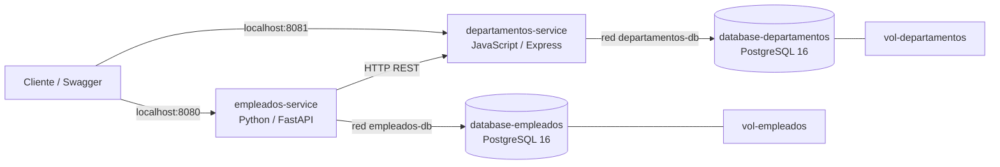

# Reto 2: Orquestación de Servicios y Persistencia de Datos

Evolución del servicio de empleados a dos microservicios independientes, cada uno
con su propia base de datos. Implementación y pruebas reales descritas en
[VERIFICACION.md](VERIFICACION.md); diagnóstico inicial en [AUDITORIA.md](AUDITORIA.md).

## Arquitectura



| Componente | Lenguaje / stack | Motor / base propia | Puerto host | Puerto contenedor |
|------------|------------------|---------------------|-------------|-------------------|
| empleados-service | Python 3.12, FastAPI, HTTPX, Psycopg 3 | PostgreSQL 16 / database-empleados | 8080 | 8080 |
| departamentos-service | JavaScript, Node.js 22, Express 5, pg | PostgreSQL 16 / database-departamentos | 8081 | 8081 |
| database-empleados | PostgreSQL | PostgreSQL 16 | No publicado | 5432 |
| database-departamentos | PostgreSQL | PostgreSQL 16 | No publicado | 5432 |

Las APIs comparten `microservices-network`. Cada BD está en una red interna
separada junto a su API; ninguna API comparte red ni credenciales con la BD ajena.
La comunicación entre APIs usa `http://departamentos-service:8081`, resuelto por
el DNS de Compose. `localhost` solo se usa desde el host o en healthchecks del
propio contenedor.

Los Dockerfiles tienen etapas para dependencias y ejecución, con usuarios sin
privilegios en las imágenes finales. La imagen de empleados incorpora el modelo
canónico de Reto 1 durante el build, sin depender de ese servicio en ejecución.

## Requisitos y arranque

- Docker con Compose v2 que soporte `--wait`; Docker Desktop/WSL 2 en Windows.
- Motor Docker iniciado y puertos 8080/8081 libres.
- Internet para descargar imágenes y dependencias en la primera construcción.
- Python 3.12/3.13 y Node.js 22 solo para pruebas o desarrollo en el host.

Desde `D:\Repositorios_UQ\Micro`:

```powershell
Set-Location D:\Repositorios_UQ\Micro\Reto_2
docker compose up --build
```

Para dejarlo en segundo plano y esperar a que esté saludable:

```powershell
docker compose up -d --build --wait --wait-timeout 180
docker compose ps
docker compose logs --no-color
docker compose down
```

Las bases tienen `pg_isready` **por TCP** y una consulta a su tabla como healthcheck.
Así no se considera listo el servidor temporal que PostgreSQL inicia durante la
ejecución de `init.sql`. Las APIs esperan `condition: service_healthy`; empleados
también espera a departamentos. `/health` verifica acceso al esquema propio.
Después del arranque, `depends_on` no monitoriza las dependencias continuamente:
si departamentos falla, empleados sigue sirviendo consultas y controla los registros con 503.

## Variables de entorno

No se necesita crear `.env` para arrancar: Compose incluye valores públicos de
demostración iguales a `.env.example`. La aplicación recibe las credenciales
mediante variables de entorno, nunca desde constantes en su código.
Para personalizar, copiar opcionalmente `.env.example` a `.env` y editarlo.
`.env` es local e ignorado por Git. No sobrescribir uno existente para ejecutar pruebas.

| Variable en `.env` | Uso / valor predeterminado |
|-------------------|---------------------------|
| `DB_EMPLEADOS_NAME`, `DB_EMPLEADOS_USER`, `DB_EMPLEADOS_PASSWORD` | Por defecto: `empleados_db`, `empleados_user`, `empleados_local_demo` |
| `DB_DEPARTAMENTOS_NAME`, `DB_DEPARTAMENTOS_USER`, `DB_DEPARTAMENTOS_PASSWORD` | Por defecto: `departamentos_db`, `departamentos_user`, `departamentos_local_demo` |
| `EMPLEADOS_PORT` | Puerto publicado en 127.0.0.1; 8080 |
| `DEPARTAMENTOS_PORT` | Puerto publicado en 127.0.0.1; 8081 |
| `DEPARTAMENTOS_SERVICE_URL` | `http://departamentos-service:8081` |
| `DEPARTAMENTOS_TIMEOUT_SECONDS` | 2 segundos por fase de operación HTTP; mayor que 0 y hasta 60 |
| `DEPARTAMENTOS_MAX_RETRIES` | 3 reintentos adicionales, máximo permitido 5 |
| `DEPARTAMENTOS_BACKOFF_SECONDS` | 1 segundo base, mayor que 0 y hasta 10 |

Compose traduce las variables de cada BD a `DB_NAME`, `DB_USER`, `DB_PASSWORD`
de su API y a `POSTGRES_*` de su contenedor PostgreSQL. `DB_HOST` es el hostname
de la BD propia y `DB_PORT=5432`. Departamentos usa `PORT=8081`; empleados escucha
8080 mediante Uvicorn. Cambiar un puerto del **host** no cambia la URL interna.

## Endpoints y Swagger

| API | Método y ruta | Respuesta |
|-----|--------------|-----------|
| Departamentos | POST `/departamentos` | 201; 400 por datos inválidos o id duplicado |
| Departamentos | GET `/departamentos/{id}` | 200; 404 descriptivo |
| Departamentos | GET `/departamentos` | 200, lista ordenada por id |
| Empleados | POST `/empleados` | 201; 400 por duplicados o departamento inexistente |
| Empleados | GET `/empleados/{id}` | 200; 404 descriptivo |
| Empleados | GET `/empleados` | 200, lista ordenada por id |
| Ambas | GET `/health` | 200 si la tabla y BD propia responden |

- Empleados: [Swagger UI](http://localhost:8080/docs),
  [OpenAPI](http://localhost:8080/openapi.json), [ReDoc](http://localhost:8080/redoc).
- Departamentos: [Swagger UI](http://localhost:8081/docs/),
  [OpenAPI](http://localhost:8081/openapi.json).

Ambas documentan schemas, solicitudes, respuestas y errores. Un error inesperado
de persistencia devuelve 500; indisponibilidad devuelve 503, sin exponer detalles
internos. Empleados conserva 422 para errores de formato del modelo original.
Departamentos rechaza JSON malformado con 400 y cuerpos mayores a 64 KiB con 413.
Swagger de FastAPI usa recursos CDN; requiere acceso del navegador a esa CDN.

## Ejemplo completo desde PowerShell

Con bases vacías, crear primero el departamento y después el empleado:

```powershell
$Departamento = @{
    id = 'IT'
    nombre = 'Tecnología'
    descripcion = 'Departamento de TI'
} | ConvertTo-Json
Invoke-RestMethod -Method Post -Uri http://localhost:8081/departamentos `
    -ContentType 'application/json; charset=utf-8' -Body ([Text.Encoding]::UTF8.GetBytes($Departamento))

$Empleado = @{
    id = 'E001'
    nombre = 'Juan'
    apellido = 'Pérez'
    email = 'juan.perez@empresa.com'
    numeroEmpleado = 'EMP-2026-001'
    cargo = 'Desarrollador Senior'
    area = 'Tecnología'
    departamentoId = 'IT'
    fechaIngreso = '2026-02-10'
    estado = 'ACTIVO'
} | ConvertTo-Json
Invoke-RestMethod -Method Post -Uri http://localhost:8080/empleados `
    -ContentType 'application/json; charset=utf-8' -Body ([Text.Encoding]::UTF8.GetBytes($Empleado))
Invoke-RestMethod http://localhost:8080/empleados/E001
Invoke-RestMethod http://localhost:8080/empleados
Invoke-RestMethod http://localhost:8081/departamentos/IT
```

Se conservan y persisten los diez campos. En Reto 2 se puede omitir `estado` en el
POST, como en los ejemplos del docente: se asigna ACTIVO automáticamente. Si se
envía, solo acepta ACTIVO, y el INSERT también lo fija en ACTIVO. Los otros nueve
campos son obligatorios. El email se normaliza a minúsculas, igual que en Reto 1.
Esta adaptación hereda el modelo original y no modifica el contrato de Reto 1.

El orden de validaciones de negocio, una vez validado el formato, es:

1. Consultar email: duplicado → 400.
2. Consultar numeroEmpleado: duplicado → 400.
3. Consultar departamento por HTTP: inexistente → 400.
4. Insertar: 201, o 400 si una restricción UNIQUE/PRIMARY KEY detecta una colisión.

El id también es único y nunca se sobrescribe. Reto 1 conserva POST 200 y su orden
original; la evolución a 201 y validación remota ocurre únicamente en Reto 2.

## Timeout, reintentos y decisión ante fallos

HTTPX configura explícitamente los timeouts de conexión, lectura, escritura y pool
con el valor indicado (2 segundos por defecto). Son límites por fase, no un plazo
global exacto de toda la solicitud. Se realizan como máximo **4 intentos** con
**3 reintentos**, esperando **1, 2 y 4 segundos** entre ellos.

Se reintentan fallos de transporte, timeouts, HTTP 429 y 5xx. Un 404 devuelve 400
inmediatamente. Otros 4xx, redirecciones y respuestas con contrato inválido devuelven
503 sin reintentos, pues no indican un fallo transitorio recuperable.

**Después de agotar timeout y reintentos rechazamos el registro con 503. No
almacenamos un empleado cuyo departamento no pudo validarse.** En la prueba con
departamentos pausado, esta respuesta tardó aproximadamente 15 segundos.
No se incorpora Circuit Breaker. Las consultas de empleados siguen disponibles
durante una caída de departamentos mientras su propia BD funcione.

## Decisiones técnicas obligatorias

### 1. Motor de base de datos por servicio

Se conserva **PostgreSQL 16 en dos instancias independientes**. Ambas entidades son
estructuradas y necesitan integridad de datos; las transacciones y restricciones
UNIQUE resuelven la persistencia y concurrencia del reto. Usar el mismo motor reduce
la variedad de administración, respaldos y healthchecks.

Ventajas: integridad transaccional, tipos fecha, restricciones y herramientas SQL.
Costos: dos procesos y volúmenes consumen más recursos; cada base requiere respaldo,
administración y evolución propia. Los drivers sí son distintos: Psycopg en Python
y `pg` en JavaScript. Compartir motor no significa compartir instancia ni tablas.

### 2. Creación y evolución del esquema

Cada servicio tiene `init.sql`, montado en `/docker-entrypoint-initdb.d/01-init.sql`.
Es una inicialización explícita y reproducible adecuada para este reto, sin ORM ni
auto-DDL destructivo. Se ejecuta **solo cuando el volumen está vacío**.

Si el esquema cambia con datos existentes, editar `init.sql` **no migra la BD**.
Se debe respaldar, preparar una migración SQL incremental (`ALTER TABLE`, limpieza
de datos incompatibles, nuevas restricciones), probarla y aplicarla a la instancia
correspondiente. No hay un ejecutor de migraciones en este reto. Si alguien ya
había inicializado los SQL parciales antiguos, debe planear esa migración antes de
reutilizar esos datos. `down -v` solo es una alternativa para datos descartables.

### 3. Garantía de unicidad

La consulta previa da un mensaje claro y respeta el orden solicitado. Dos peticiones
concurrentes pueden consultar antes de que cualquiera inserte, por lo que esa consulta
no basta. PostgreSQL impone UNIQUE sobre `email` y `numero_empleado`, y PRIMARY KEY
sobre `id`: solo una transacción puede confirmar la misma clave.

Psycopg revierte la transacción fallida; la aplicación convierte `UniqueViolation`
en 400 e identifica la restricción. Departamentos convierte SQLSTATE 23505 en 400.
Las consultas SQL son parametrizadas. No hay llaves foráneas entre bases: el vínculo
con departamentos se comprueba exclusivamente por HTTP.

## Persistencia y limpieza

```powershell
docker compose down
docker compose up -d --wait
# E001 e IT siguen existiendo:
Invoke-RestMethod http://localhost:8080/empleados/E001
Invoke-RestMethod http://localhost:8081/departamentos/IT

# Elimina los datos de AMBAS bases de este proyecto:
docker compose down -v
docker compose up -d --build --wait
# Ambas listas deben estar vacías:
Invoke-RestMethod http://localhost:8080/empleados
Invoke-RestMethod http://localhost:8081/departamentos
```

Los volúmenes se llaman `<proyecto>_vol-empleados` y `<proyecto>_vol-departamentos`;
el proyecto habitual es `reto_2`. Cambiar `-p` crea un conjunto distinto de volúmenes.
No hay datos semilla. Cambiar variables `POSTGRES_*` tampoco cambia automáticamente
usuarios o contraseñas de un volumen ya inicializado.

## Pruebas reproducibles

Desde la raíz:

```powershell
Set-Location D:\Repositorios_UQ\Micro
python -m venv .venv
.\.venv\Scripts\python.exe -m pip install -r Reto_2/requirements-test.txt
.\.venv\Scripts\python.exe -m pytest Reto_2/tests -q
npm --prefix Reto_2/departamentos ci
npm --prefix Reto_2/departamentos test

Push-Location Reto_1
..\.venv\Scripts\python.exe -m pytest -q
Pop-Location

# Prueba integral real, no requiere librerías Python externas:
.\.venv\Scripts\python.exe Reto_2/tests/e2e.py
```

La prueba E2E desactiva la carga del `.env` mediante el dispositivo nulo del sistema
y elimina las variables de credenciales heredadas: verifica los valores por defecto
de Compose, un nombre de proyecto aleatorio y puertos libres.
Verifica arranque, healthy, logs, Swagger/OpenAPI, altas, campos completos, errores,
24 peticiones concurrentes, timeout real mediante `pause`, recuperación,
persistencia con `down` y eliminación con `down -v`. Al terminar limpia exclusivamente
sus propios contenedores y volúmenes. No modifica el proyecto habitual ni su `.env`.

Los tests unitarios aíslan el orden de validación, el mapeo de errores UNIQUE, los
reintentos/backoff y las respuestas; E2E comprueba esas funciones con HTTP y BD reales.

Prueba opcional en navegador (Windows con Edge instalado): con el Compose en
8080/8081 y sin los registros IT/E001, ejecutar desde la raíz:

```powershell
.\.venv\Scripts\python.exe -m pip install playwright
.\.venv\Scripts\python.exe -m Reto_2.tests.swagger_browser
```

Abre Edge sin ventana, comprueba el renderizado y ejecuta POST y GET desde ambos
Swagger. Deja IT y E001 creados; si ya existen, usar otros ids o un entorno vacío.

## Documentación por servicio y referencias

- [Empleados](empleados/README.md): ejecución local y organización interna.
- [Departamentos](departamentos/README.md): configuración, desarrollo y contrato.
- [Docker: orden de arranque](https://docs.docker.com/compose/how-tos/startup-order/):
  `service_healthy` permite esperar a dependencias listas.
- [Docker: redes en Compose](https://docs.docker.com/compose/how-tos/networking/):
  resolución de servicios por nombre.
- [Node.js: calendario de versiones](https://github.com/nodejs/Release): elección de Node 22.
