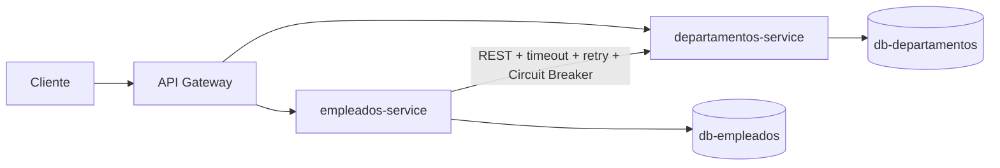
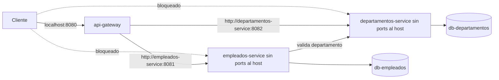

# Reto 3 - API Gateway y Resiliencia

Este reto evoluciona el ecosistema de `Reto_2` sin modificar los retos
anteriores. La fase actual deja implementado y probado todo lo previo a Docker:
API Gateway, Circuit Breaker, fallback 503, estado observable, pruebas unitarias
y documentacion. La integracion final con Docker Compose queda pendiente.

## 1. Objetivo

Agregar un punto unico de entrada para clientes y resiliencia en la comunicacion
`empleados-service -> departamentos-service`.

La regla de negocio se mantiene: no se registra un empleado si su departamento no
puede validarse.

## 2. Contexto heredado de Reto 2

`Reto_2` ya tenia dos servicios y dos bases independientes:

| Servicio | Stack | Responsabilidad |
| --- | --- | --- |
| empleados-service | Python, FastAPI, HTTPX, Psycopg | Gestiona empleados y valida departamentos por HTTP |
| departamentos-service | JavaScript, Express, pg | Gestiona departamentos |

`Reto_3` copia esa base funcional y agrega `api-gateway`, Circuit Breaker con
`pybreaker`, endpoint tecnico para observar el estado de la dependencia y pruebas
pre-Docker sin contenedores.

## 3. Arquitectura



Arquitectura objetivo al dockerizar:



## 4. API Gateway

El Gateway es una aplicacion FastAPI, no Nginx, Traefik, Kong ni un proxy externo.
Centraliza preocupaciones de borde y no contiene reglas de negocio.

Implementado en `api-gateway/app/config.py` y `api-gateway/app/main.py`.

## 5. Justificacion de FastAPI + httpx

FastAPI mantiene coherencia con empleados y deja listo el borde para retos
posteriores como JWT, autorizacion y propagacion de identidad. `httpx` ya se usa
en empleados, soporta timeouts explicitos, transportes mockeables y pruebas
rapidas sin levantar servicios reales.

## 6. Tabla de rutas

| Ruta externa | Servicio interno objetivo | Ruta interna |
| --- | --- | --- |
| `/empleados` | empleados-service | `/empleados` |
| `/empleados/*` | empleados-service | Misma ruta |
| `/departamentos` | departamentos-service | `/departamentos` |
| `/departamentos/*` | departamentos-service | Misma ruta |
| `/health` | api-gateway | Respuesta propia |

El proxy preserva metodo, path, query string, body, `Content-Type`, headers de
aplicacion, status code y body del backend. No propaga headers hop-by-hop como
`connection`, `keep-alive`, `proxy-authenticate`, `proxy-authorization`, `te`,
`trailer`, `transfer-encoding`, `upgrade`, `host` ni `content-length`.

## 7. Variables de entorno

| Variable | Uso |
| --- | --- |
| `GATEWAY_PORT` | Puerto futuro del Gateway: 8080 |
| `EMPLEADOS_URL` | URL interna futura: `http://empleados-service:8081` |
| `DEPARTAMENTOS_URL` | URL interna futura: `http://departamentos-service:8082` |
| `GATEWAY_REQUEST_TIMEOUT_SECONDS` | Timeout del Gateway hacia upstreams |
| `DEPARTAMENTOS_SERVICE_URL` | URL usada por empleados hacia departamentos |
| `DEPARTAMENTOS_TIMEOUT_SECONDS` | Timeout de empleados hacia departamentos |
| `DEPARTAMENTOS_MAX_RETRIES` | Reintentos adicionales |
| `DEPARTAMENTOS_BACKOFF_SECONDS` | Backoff base |
| `DEPARTAMENTOS_CB_FAIL_MAX` | Fallos requeridos para abrir el circuito |
| `DEPARTAMENTOS_CB_RESET_TIMEOUT_SECONDS` | Tiempo para probar recuperacion |

## 8. Circuit Breaker

El Circuit Breaker esta en `empleados-service`, exactamente en la llamada
`empleados -> departamentos`. Se usa `pybreaker`; no hay implementacion manual.

## 9. Parametros elegidos

| Parametro | Valor inicial | Configurable |
| --- | --- | --- |
| `fail_max` | 3 | `DEPARTAMENTOS_CB_FAIL_MAX` |
| `reset_timeout` | 30 segundos | `DEPARTAMENTOS_CB_RESET_TIMEOUT_SECONDS` |
| timeout HTTP | 2 segundos | `DEPARTAMENTOS_TIMEOUT_SECONDS` |
| retries | 3 adicionales | `DEPARTAMENTOS_MAX_RETRIES` |
| backoff | 1, 2, 4 segundos | `DEPARTAMENTOS_BACKOFF_SECONDS` |

## 10. Estados CLOSED / OPEN / HALF_OPEN

| Estado | Comportamiento |
| --- | --- |
| `closed` | Se consulta departamentos normalmente |
| `open` | No se intenta red; fallback inmediato 503 |
| `half-open` | Se permite una llamada de prueba tras el reset timeout |

Las transiciones se registran en logs mediante un listener de `pybreaker`.

## 11. Interaccion timeout + retry + circuit breaker

El breaker envuelve el resultado global de una validacion de departamento:

```text
POST /empleados
  -> Circuit Breaker
     -> intento HTTP
     -> retry
     -> retry
     -> retry
     -> exito o fallo definitivo
```

Asi, una sola peticion de negocio con varios retries cuenta como un solo fallo
para el Circuit Breaker si todos los intentos fallan.

## 12. Estrategia de fallback

Fallback elegido: `503 Service Unavailable`.

No se registra el empleado cuando departamentos no puede validarse. No se inventa
un departamento por defecto y no se deja un empleado pendiente de reconciliacion.

## 13. Razon de priorizar consistencia

RRHH no debe guardar empleados asociados a un departamento no validado. Esta
decision evita estados intermedios y procesos asincronos que pertenecen a retos
posteriores.

## 14. Manejo de errores

| Caso | Respuesta |
| --- | --- |
| Departamento inexistente (`404`) | `400`, no abre circuito |
| Timeout, red, reset, 5xx | Reintentos; si falla todo, `503` y cuenta como fallo tecnico |
| Circuito abierto | `503` inmediato, sin llamada HTTP |
| Upstream caido desde Gateway | `503` JSON estable |
| 400/404/500 del backend por Gateway | Se propaga status y body |

## 15. Estado observable

Empleados expone:

```http
GET /health/dependencies
```

Respuesta:

```json
{
  "status": "ok",
  "dependencies": [
    {
      "dependency": "departamentos-service",
      "state": "closed"
    }
  ]
}
```

El valor sale del Circuit Breaker real (`pybreaker.current_state`).

## 16. Pruebas pre-Docker

Desde la raiz:

```powershell
.\.venv\Scripts\python.exe -m pip install -r Reto_3/requirements-test.txt
.\.venv\Scripts\python.exe -m pytest Reto_3/tests -q
npm --prefix Reto_3/departamentos ci
npm --prefix Reto_3/departamentos test
```

Estas pruebas no dependen de Docker.

## 17. Arquitectura objetivo cuando se dockerice

| Servicio | Puerto host | Puerto contenedor | Publicacion |
| --- | --- | --- | --- |
| api-gateway | 8080 | 8080 | `ports` |
| empleados-service | Ninguno | 8081 | `expose` |
| departamentos-service | Ninguno | 8082 | `expose` |

Variables objetivo:

```env
EMPLEADOS_URL=http://empleados-service:8081
DEPARTAMENTOS_URL=http://departamentos-service:8082
DEPARTAMENTOS_SERVICE_URL=http://departamentos-service:8082
```

## 18. Prueba manual futura del Circuit Breaker

Cuando exista Docker Compose:

1. Levantar todo por Gateway.
2. Crear un departamento.
3. Crear empleado exitosamente por Gateway.
4. Detener `departamentos-service`.
5. Enviar tres altas de empleados con departamento existente.
6. Ver que las primeras consumen timeout/retry.
7. Ver que luego responde 503 inmediato por circuito abierto.
8. Consultar `/health/dependencies`.
9. Restaurar departamentos.
10. Esperar `reset_timeout`.
11. Enviar una nueva alta y observar recuperacion.

## 19. Evidencias pendientes de Docker

No se incluyen capturas ficticias. Las evidencias reales quedan listadas en
`docs/evidencias/README.md`.

## 20. Trabajo pendiente para el integrante encargado de Docker

- Crear Compose de `Reto_3`.
- Ajustar puertos internos a empleados `8081` y departamentos `8082`.
- Publicar solo Gateway en host `8080`.
- Convertir acceso directo a empleados/departamentos en `expose`.
- Agregar healthchecks y `depends_on.condition: service_healthy`.
- Ejecutar pruebas runtime y capturar evidencias.
- Completar la seccion de verificacion posterior a Docker.
