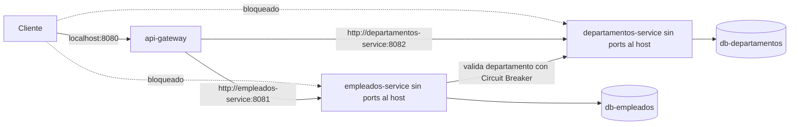

# Reto 3 - API Gateway y Resiliencia

Este reto evoluciona el ecosistema de `Reto_2` sin modificar los retos
anteriores. Incluye API Gateway, Circuit Breaker, fallback 503, estado
observable, pruebas unitarias, documentacion **y la integracion completa con
Docker Compose**, ya probada de punta a punta.

## 1. Objetivo

Agregar un punto unico de entrada para clientes y resiliencia en la comunicacion
`empleados-service -> departamentos-service`.

La regla de negocio se mantiene: no se registra un empleado si su departamento no
puede validarse.

## 2. Contexto heredado de Reto 2

`Reto_2` ya tenia dos servicios y dos bases independientes:

| Servicio | Stack | Responsabilidad |
| --- | --- | --- |
| empleados-service | Python, FastAPI, HTTPX, Psycopg | Gestiona empleados y valida departamentos por HTTP |
| departamentos-service | JavaScript, Express, pg | Gestiona departamentos |

`Reto_3` copia esa base funcional y agrega `api-gateway`, Circuit Breaker con
`pybreaker`, endpoint tecnico para observar el estado de la dependencia y
orquestacion completa con Docker Compose.

## 3. Arquitectura



## 4. API Gateway

El Gateway es una aplicacion FastAPI, no Nginx, Traefik, Kong ni un proxy externo.
Centraliza preocupaciones de borde y no contiene reglas de negocio.

Implementado en `api-gateway/app/config.py` y `api-gateway/app/main.py`.
Dockerizado en `api-gateway/Dockerfile` (build multi-stage).

## 5. Justificacion de FastAPI + httpx

FastAPI mantiene coherencia con empleados y deja listo el borde para retos
posteriores como JWT, autorizacion y propagacion de identidad. `httpx` ya se usa
en empleados, soporta timeouts explicitos, transportes mockeables y pruebas
rapidas sin levantar servicios reales.

## 6. Tabla de rutas

| Ruta externa | Servicio interno objetivo | Ruta interna |
| --- | --- | --- |
| `/empleados` | empleados-service | `/empleados` |
| `/empleados/*` | empleados-service | Misma ruta |
| `/departamentos` | departamentos-service | `/departamentos` |
| `/departamentos/*` | departamentos-service | Misma ruta |
| `/health` | api-gateway | Respuesta propia |

El proxy preserva metodo, path, query string, body, `Content-Type`, headers de
aplicacion, status code y body del backend. No propaga headers hop-by-hop como
`connection`, `keep-alive`, `proxy-authenticate`, `proxy-authorization`, `te`,
`trailer`, `transfer-encoding`, `upgrade`, `host` ni `content-length`.

## 7. Variables de entorno

| Variable | Uso |
| --- | --- |
| `GATEWAY_PORT` | Puerto publicado al host: 8080 |
| `EMPLEADOS_URL` | URL interna: `http://empleados-service:8081` |
| `DEPARTAMENTOS_URL` | URL interna: `http://departamentos-service:8082` |
| `GATEWAY_REQUEST_TIMEOUT_SECONDS` | Timeout del Gateway hacia upstreams. **Recomendado: 20** (ver nota abajo) |
| `DEPARTAMENTOS_SERVICE_URL` | URL usada por empleados hacia departamentos |
| `DEPARTAMENTOS_TIMEOUT_SECONDS` | Timeout de empleados hacia departamentos |
| `DEPARTAMENTOS_MAX_RETRIES` | Reintentos adicionales |
| `DEPARTAMENTOS_BACKOFF_SECONDS` | Backoff base |
| `DEPARTAMENTOS_CB_FAIL_MAX` | Fallos requeridos para abrir el circuito |
| `DEPARTAMENTOS_CB_RESET_TIMEOUT_SECONDS` | Tiempo para probar recuperacion |

> **Nota importante sobre `GATEWAY_REQUEST_TIMEOUT_SECONDS`:** el valor por
> defecto (5s) es menor que el tiempo que puede tardar `empleados-service` en
> agotar sus reintentos hacia `departamentos-service` (timeout 2s × 4 intentos +
> backoff 1+2+4s ≈ 15s). Si el Gateway se rinde antes que `empleados-service`,
> se observa un 503 del **Gateway**, no del Circuit Breaker, y todas las
> peticiones tardan lo mismo. Por eso el `.env.example` fija
> `GATEWAY_REQUEST_TIMEOUT_SECONDS=20`: le da margen suficiente al Circuit
> Breaker para completar su primer ciclo de fallos y abrirse.

## 8. Circuit Breaker

El Circuit Breaker esta en `empleados-service`, exactamente en la llamada
`empleados -> departamentos`. Se usa `pybreaker`; no hay implementacion manual.

## 9. Parametros elegidos

| Parametro | Valor inicial | Configurable |
| --- | --- | --- |
| `fail_max` | 3 | `DEPARTAMENTOS_CB_FAIL_MAX` |
| `reset_timeout` | 30 segundos | `DEPARTAMENTOS_CB_RESET_TIMEOUT_SECONDS` |
| timeout HTTP | 2 segundos | `DEPARTAMENTOS_TIMEOUT_SECONDS` |
| retries | 3 adicionales | `DEPARTAMENTOS_MAX_RETRIES` |
| backoff | 1, 2, 4 segundos | `DEPARTAMENTOS_BACKOFF_SECONDS` |

## 10. Estados CLOSED / OPEN / HALF_OPEN

| Estado | Comportamiento |
| --- | --- |
| `closed` | Se consulta departamentos normalmente |
| `open` | No se intenta red; fallback inmediato 503 |
| `half-open` | Se permite una llamada de prueba tras el reset timeout |

Las transiciones se registran en logs mediante un listener de `pybreaker`.

## 11. Interaccion timeout + retry + circuit breaker

El Circuit Breaker de `pybreaker` cuenta como fallo cada **intento HTTP
individual**, no la peticion de negocio completa. Con `fail_max=3`, esto tiene
una consecuencia observable importante: el circuito puede abrirse **dentro de
la primera peticion de registro**, apenas fallan sus primeros 3 intentos
internos, en vez de esperar a que fallen 3-5 peticiones de negocio distintas.

Verificado en pruebas de integracion: la primera peticion con departamentos
caido tardo ~19.3s (agotando el ciclo completo de reintentos hasta que el
circuito abrio a mitad de camino); las siguientes 7 peticiones respondieron en
~0.03s cada una, con el circuito ya `OPEN`. El salto de 19.3s a 0.03s es la
evidencia de que el Circuit Breaker esta funcionando.

```text
POST /empleados
  -> Circuit Breaker (cuenta cada intento)
     -> intento HTTP (fallo 1)
     -> retry (fallo 2)
     -> retry (fallo 3 -> abre el circuito)
     -> retry restante ya ve el circuito abierto -> fallback inmediato
```

## 12. Estrategia de fallback

Fallback elegido: `503 Service Unavailable`, con mensaje explicito indicando
que el Circuit Breaker esta abierto.

No se registra el empleado cuando departamentos no puede validarse. No se inventa
un departamento por defecto y no se deja un empleado pendiente de reconciliacion.

## 13. Razon de priorizar consistencia

RRHH no debe guardar empleados asociados a un departamento no validado. Esta
decision evita estados intermedios y procesos asincronos que pertenecen a retos
posteriores.

## 14. Manejo de errores

| Caso | Respuesta |
| --- | --- |
| Departamento inexistente (`404`) | `400`, no abre circuito |
| Timeout, red, reset, 5xx | Reintentos; si falla todo, `503` y cuenta como fallo tecnico |
| Circuito abierto | `503` inmediato, sin llamada HTTP, mensaje explicito de Circuit Breaker |
| Upstream caido desde Gateway | `503` JSON estable (`upstream_unavailable`) |
| 400/404/500 del backend por Gateway | Se propaga status y body |

## 15. Estado observable

Empleados expone:

```http
GET /health/dependencies
```

Respuesta:

```json
{
  "status": "ok",
  "dependencies": [
    {
      "dependency": "departamentos-service",
      "state": "closed"
    }
  ]
}
```

El valor sale del Circuit Breaker real (`pybreaker.current_state`).

## 16. Pruebas pre-Docker (unitarias)

Desde la raiz:

```powershell
.\.venv\Scripts\python.exe -m pip install -r Reto_3/requirements-test.txt
.\.venv\Scripts\python.exe -m pytest Reto_3/tests -q
npm --prefix Reto_3/departamentos ci
npm --prefix Reto_3/departamentos test
```

Estas pruebas no dependen de Docker.

## 17. Arquitectura Docker (implementada)

| Servicio | Puerto host | Puerto contenedor | Publicacion |
| --- | --- | --- | --- |
| api-gateway | 8080 | 8080 | `ports` |
| empleados-service | Ninguno | 8081 | `expose` |
| departamentos-service | Ninguno | 8082 | `expose` |

Variables usadas en runtime:

```env
EMPLEADOS_URL=http://empleados-service:8081
DEPARTAMENTOS_URL=http://departamentos-service:8082
DEPARTAMENTOS_SERVICE_URL=http://departamentos-service:8082
GATEWAY_REQUEST_TIMEOUT_SECONDS=20
```

`empleados-service` reutiliza `Reto_1/app/models.py`, igual que en `Reto_2`; por
eso su build usa como contexto la raiz del repositorio (`context: ..`) en vez de
su propia carpeta.

Redes: `microservices-network` (compartida entre los 3 servicios de aplicacion),
`empleados-db` y `departamentos-db` (redes internas, una por par
servicio-base de datos, para que ningun servicio pueda alcanzar la base de datos
del otro).

## 18. Prueba manual del Circuit Breaker (ejecutada y verificada)

```powershell
cd Reto_3
copy .env.example .env
docker compose up --build
```

En otra terminal:

```powershell
# 1. Verificar punto de entrada unico
curl http://localhost:8080/health
curl http://localhost:8080/departamentos
curl http://localhost:8080/empleados
curl http://localhost:8081/empleados      # debe fallar (conexion rechazada)
curl http://localhost:8082/departamentos  # debe fallar (conexion rechazada)

# 2. Crear un departamento con el sistema sano
Invoke-WebRequest -Uri http://localhost:8080/departamentos -Method POST `
  -ContentType "application/json" `
  -Body '{"id":"IT","nombre":"Tecnologia","descripcion":"Tecnologia"}'

# 3. Apagar departamentos y observar el 503 del Gateway
docker compose stop departamentos-service
Invoke-WebRequest -Uri http://localhost:8080/departamentos -Method GET

# 4. Enviar 8 altas de empleados y medir el tiempo de cada una
for ($i=1; $i -le 8; $i++) {
  $body = @{
    id="E10$i"; nombre="Test $i"; apellido="T"; email="test$i@x.com"
    numeroEmpleado="N10$i"; cargo="Dev"; area="IT"; departamentoId="IT"
    fechaIngreso="2026-01-01"; estado="ACTIVO"
  } | ConvertTo-Json
  Measure-Command {
    try { Invoke-RestMethod -Uri http://localhost:8080/empleados -Method POST -ContentType "application/json" -Body $body }
    catch { Write-Host "Error: $($_.Exception.Response.StatusCode)" }
  } | Select-Object TotalSeconds
}

# 5. Restaurar y esperar el reset_timeout (30s)
docker compose start departamentos-service
Start-Sleep -Seconds 35

# 6. Confirmar recuperacion automatica con un departamento inexistente (debe dar 400, no 503)
Invoke-RestMethod -Uri http://localhost:8080/empleados -Method POST -ContentType "application/json" -Body (@{
  id="E201"; nombre="Recuperado"; apellido="T"; email="e201@x.com"
  numeroEmpleado="N201"; cargo="Dev"; area="IT"; departamentoId="NO-EXISTE"
  fechaIngreso="2026-01-01"; estado="ACTIVO"
} | ConvertTo-Json)
```

**Resultado observado:**

- Peticion 1: ~19.3 segundos (agota reintentos, abre el circuito a mitad de
  camino) -> `503` con mensaje de Circuit Breaker abierto.
- Peticiones 2-8: ~0.03 segundos cada una -> `503` inmediato, sin tocar la red.
- Tras restaurar `departamentos-service` y esperar 35s, la peticion con
  `departamentoId: "NO-EXISTE"` devolvio `400` (`"El departamento con id
  NO-EXISTE no existe"`), confirmando que el circuito volvio a `CLOSED` y
  consulto de verdad a departamentos -- sin reiniciar ningun contenedor.

## 19. Evidencias

Las evidencias de estas pruebas (aislamiento de puertos, salto en el tiempo de
respuesta y recuperacion automatica) se demuestran en vivo durante la
sustentacion, ejecutando los comandos de la seccion 18 directamente sobre el
sistema levantado con `docker compose up --build`.

## 20. Estado de la integracion Docker

Completada y verificada:

- [x] Compose de `Reto_3` creado con los 5 servicios (2 bases de datos, 2 servicios de negocio, 1 gateway).
- [x] Puertos internos ajustados: empleados `8081`, departamentos `8082`.
- [x] Solo `api-gateway` publica puerto al host (`8080`).
- [x] `empleados-service` y `departamentos-service` usan `expose`, no `ports`.
- [x] Healthchecks y `depends_on: condition: service_healthy` en toda la cadena.
- [x] Pruebas runtime del Circuit Breaker ejecutadas y verificadas.
- [x] Dockerfiles multi-stage para los tres servicios de aplicacion, con usuario no-root.