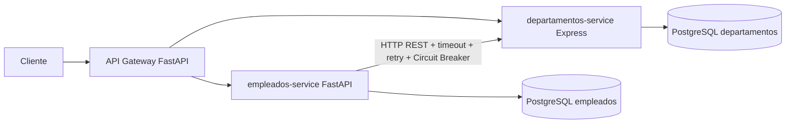

# Arquitectura Reto 3

Cuando se dockerice, el cliente debe acceder solo al Gateway. Empleados y
departamentos quedaran accesibles dentro de la red de Compose mediante `expose`,
sin `ports` publicados al host.
