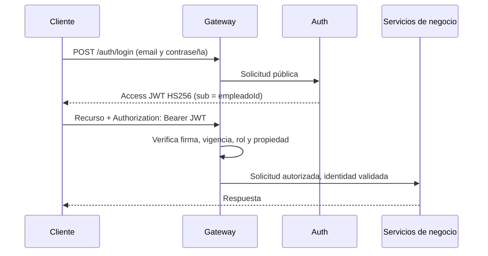
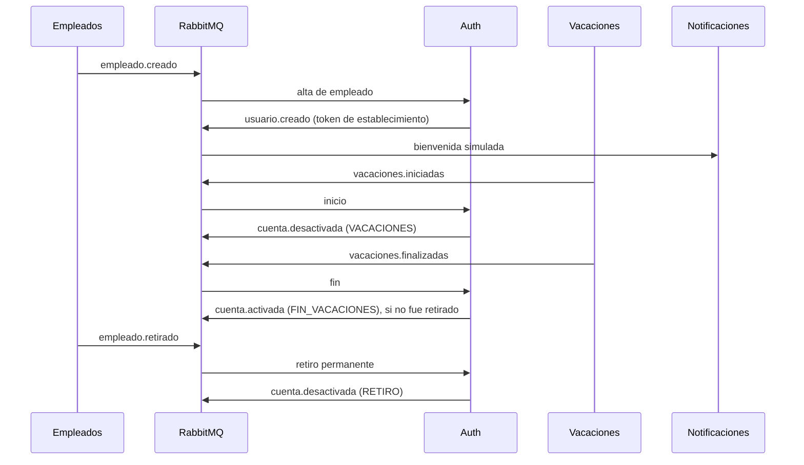

# Reto 5: seguridad y control de acceso

## Estado comprobado

La carpeta del Reto 5 contiene Auth, Gateway, Notificaciones y Vacaciones con la lógica de seguridad y eventos. Empleados, Departamentos y Perfiles se reutilizan desde el Reto 4. Los contratos se contrastaron con `C:\Users\Usuario\Desktop\catalogo-de-eventos.pdf`, versión 1.0, secciones 2 y 3.1–3.10. **No existe configuración Docker del Reto 5 ni se ejecutó un flujo integrado con broker y bases**. La guía [INSTRUCCIONES_CLAUDE_RETO5.md](INSTRUCCIONES_CLAUDE_RETO5.md) describe la integración de despliegue pendiente.

El código existente confirma cinco bases independientes, RabbitMQ `rrhh.events`, Gateway HTTP en 8080 y Vacaciones en el puerto interno 8085. El enunciado dibuja Auth también en 8085; ese conflicto requiere una elección de puerto durante la integración, sin cambiar el puerto de Vacaciones por accidente.

## Arquitectura lógica implementada



El Gateway valida todos los recursos externos en un solo lugar. Los servicios internos deben quedar accesibles únicamente desde la red de servicios. Antes de reenviar una solicitud, el Gateway elimina cualquier `X-Authenticated-Employee-Id` y `X-Authenticated-Role` recibido del cliente y agrega valores derivados del JWT validado. No reenvía el Bearer a los servicios de negocio; Auth valida por sí mismo el token de `/auth/change-password`.

## API y política de acceso

| Ruta | Acceso | Estado |
|---|---|---|
| `POST /auth/login` | Público | Funciona con una cuenta activa y contraseña establecida. |
| `POST /auth/recover-password` | Público | Publica `usuario.recuperacion` para cuentas existentes sin revelar su existencia en la respuesta HTTP. |
| `POST /auth/reset-password` | Público | Valida reset JWT y versión de credencial; en el primer establecimiento activa la cuenta y publica `cuenta.activada`. |
| `POST /auth/change-password` | Bearer | Verifica la contraseña actual de `token.sub`. El body no admite un ID de cuenta objetivo. |
| `GET` o `HEAD` de recursos | Bearer `ADMIN` o `USER` | Lectura permitida. |
| Escritura en `/empleados`, `/departamentos`, `/notificaciones`, `/vacaciones` | Bearer `ADMIN` | `USER` recibe `403`. |
| `PUT /perfiles/{empleadoId}` | Bearer `ADMIN` o `USER` propietario | Para `USER`, `empleadoId` debe coincidir exactamente con `token.sub`. |
| `GET /notificaciones/seguridad/{id}/token` | Bearer `ADMIN` | Consulta un token de entrega simulado solo mientras esté vigente; un `USER` recibe `403`. |

Las rutas públicas de documentación son `GET /docs`, `/openapi.json`, `/auth/docs`, `/auth/openapi.json`, `/empleados/docs`, `/empleados/openapi.json`, `/perfiles/docs`, `/perfiles/openapi.json`, `/notificaciones/docs`, `/notificaciones/openapi.json`, `/notificaciones/openapi.json/swagger-config`, `/vacaciones/docs`, `/vacaciones/v1/openapi.json` y `/departamentos/openapi.json`. También es público `GET /health` del Gateway. La lista del código se compara por método y ruta completos. Las demás solicitudes requieren access token. Los esquemas OpenAPI de negocio que atraviesan el Gateway reciben `BearerAuth` y un servidor relativo `/`; el Swagger de Auth marca `/auth/change-password` como protegido.

Para usar Swagger, abrir `/docs` o el `/docs` del servicio correspondiente, pulsar **Authorize** e introducir el access token. En una solicitud HTTP, la cabecera es:

```http
Authorization: Bearer <access_token>
```

Sin token, con firma incorrecta, algoritmo distinto de HS256, token vencido, malformado o de recuperación en una ruta de acceso, el Gateway responde `401`. Una identidad válida sin permiso de rol o propiedad recibe `403`.

## Cuentas, contraseñas y tokens

La clave de identidad es el `id` estable del empleado. Aunque el login recibe `email`, el JWT de acceso lleva `sub=empleadoId` para poder comparar `PUT /perfiles/{empleadoId}` con el propietario. Sus claims obligatorios son `iss`, `sub`, `type=ACCESS`, `role`, `iat` y `exp`. Solo se acepta HS256. El tiempo por defecto es 900 segundos y se configura con `JWT_ACCESS_TTL_SECONDS`.

El token de establecimiento/recuperación es otro JWT firmado, con `type=RESET_PASSWORD`, `sub`, `credentialVersion`, `iat` y `exp`. Su tiempo por defecto es 1800 segundos; `JWT_RESET_TTL_SECONDS` admite 900 a 3600. Al establecer o cambiar la contraseña se incrementa `credentialVersion`, lo que invalida los reset tokens anteriores de esa cuenta. No se acepta como Bearer de acceso.

Las contraseñas solo se guardan como bcrypt. La política exige entre 12 y 128 caracteres, máximo 72 bytes UTF-8, una mayúscula, una minúscula y un dígito. No hay contraseña inicial del empleado: su cuenta empieza `INACTIVA`. Los otros estados son `ACTIVA`, `SUSPENDIDA_TEMPORAL` y `DESACTIVADA_PERMANENTE`. La lógica de transiciones permite suspensión y reactivación temporal, pero una cuenta retirada nunca vuelve a activarse al recibir un fin de vacaciones.

Para crear un administrador semilla, configurar conjuntamente `ADMIN_EMPLOYEE_ID`, `ADMIN_EMAIL` y `ADMIN_PASSWORD_HASH`. El último debe ser un hash bcrypt generado por `python Reto_5/auth/hash_admin.py` (pide la contraseña de forma interactiva). El servicio lo inserta una sola vez con rol `ADMIN` y estado `ACTIVA`; reiniciar el servicio no restablece su contraseña. No se incluye ninguna clave por defecto.

## Configuración de aplicación

| Servicio | Variable | Uso |
|---|---|---|
| Auth y Gateway | `JWT_SECRET` | Mismo secreto simétrico, mínimo 32 bytes UTF-8. Debe llegar desde un almacén/configuración de entorno, nunca desde el repositorio. |
| Auth | `JWT_ACCESS_TTL_SECONDS`, `JWT_RESET_TTL_SECONDS` | Duraciones opcionales; valores predeterminados 900 y 1800. |
| Auth | `DB_HOST`, `DB_PORT`, `DB_NAME`, `DB_USER`, `DB_PASSWORD` | Base PostgreSQL propia de cuentas. `DB_PORT` tiene valor predeterminado 5432. |
| Auth | `ADMIN_EMPLOYEE_ID`, `ADMIN_EMAIL`, `ADMIN_PASSWORD_HASH` | Bootstrap opcional del administrador. Deben configurarse juntos. |
| Auth | `RABBITMQ_HOST`, `RABBITMQ_USER`, `RABBITMQ_PASSWORD` | Conexión al exchange `rrhh.events` y consumo de `auth.events`. |
| Gateway | `AUTH_URL` | URL HTTP interna de Auth; no tiene puerto predeterminado. |
| Gateway | `EMPLEADOS_URL`, `DEPARTAMENTOS_URL`, `PERFILES_URL`, `NOTIFICACIONES_URL`, `VACACIONES_URL`, `GATEWAY_REQUEST_TIMEOUT_SECONDS` | URLs de servicios existentes y timeout. Los valores predeterminados de negocio proceden del Reto 4. |
| Vacaciones | `VACACIONES_SCHEDULER_INTERVAL_SECONDS` | Intervalo entre ciclos, default 60; admite 1–3600 segundos. |
| Notificaciones y Vacaciones | `DB_*`, `RABBITMQ_HOST`, `RABBITMQ_USER`, `RABBITMQ_PASSWORD` | Sus bases independientes y broker, siguiendo Reto 4. Notificaciones requiere incorporar al despliegue la configuración Spring existente del Reto 4 o su equivalente; no se agregó aquí un archivo de configuración de puertos. |

Las dos aplicaciones Python importan `shared.tokens` desde `Reto_5/shared`; el empaquetado posterior debe incluir esa carpeta en ambas aplicaciones.

## Eventos y scheduler

Todos los mensajes usan el sobre oficial `id` UUID, `type`, `version=1`, `occurredAt` UTC, `producer` y `data`. Auth consume `empleado.creado`, `empleado.retirado`, `vacaciones.iniciadas` y `vacaciones.finalizadas` desde la cola lógica `auth.events`. Su marcador en `eventos_procesados` y la transición de `cuentas` se confirman en una misma transacción; el ACK se envía después. Se rechazan mensajes inválidos, se reencolan errores temporales y el consumidor intenta reconectarse. Auth publica los cuatro eventos salientes por `rrhh.events` con confirmación y mensajes persistentes.

| Evento saliente de Auth | Campos `data` según el catálogo |
|---|---|
| `usuario.creado` | `empleadoId`, `email`, `tokenActivacion`, `expiraEn` |
| `usuario.recuperacion` | `email`, `tokenRecuperacion`, `expiraEn` |
| `cuenta.activada` | `empleadoId`, `email`, `motivo` (`ACTIVACION_INICIAL` o `FIN_VACACIONES`) |
| `cuenta.desactivada` | `empleadoId`, `email`, `motivo` y `permanente` (`VACACIONES`/`false` o `RETIRO`/`true`) |

Notificaciones conserva el historial del Reto 4 y añade `SEGURIDAD` y `CUENTA`; también registra inicio y fin de vacaciones como `VACACIONES`. El evento `usuario.recuperacion` solo trae email, por lo que su registro tiene `empleado_id` nulo. Los tokens de activación y recuperación se guardan en columnas separadas con expiración y **no aparecen en los listados ni en logs**. Para la demostración, un `ADMIN` puede obtener el token vigente por `GET /notificaciones/seguridad/{id}/token`, donde `{id}` es el UUID del evento. El Gateway elimina cualquier header de identidad suministrado por el cliente antes de reenviar la solicitud.

El `BackgroundService` de Vacaciones corre al iniciar y luego cada `VACACIONES_SCHEDULER_INTERVAL_SECONDS`. Termina primero los períodos `EN_CURSO` cuya `fechaFin <= hoy` y después inicia los `PROGRAMADA` cuya `fechaInicio <= hoy`. Una actualización SQL condicionada por estado y fecha impide repetir cada transición. Publica `vacaciones.iniciadas` con `vacacionesId`, `empleadoId`, `email`, `fechaInicio`, `fechaFin`, y `vacaciones.finalizadas` con `vacacionesId`, `empleadoId`, `email`, `fechaFin`.

Para la demostración rápida, el Reto 5 admite `fechaInicio=fechaFin=hoy`. La migración de aplicación actualiza el CHECK de la tabla para volúmenes existentes. Al finalizar primero y comenzar después, una vacación de un día queda `EN_CURSO` durante un ciclo y pasa a `FINALIZADA` en el siguiente, permitiendo observar el login denegado y la reactivación sin esperar días. `RunOnce(DateOnly)` recibe una fecha explícita para pruebas sin depender del reloj real.

El ciclo de vida implementado es:



Las transiciones probadas impiden que `vacaciones.finalizadas` reactive una cuenta retirada. Los flujos de eventos se probaron a nivel de servicio; el intercambio real entre contenedores queda pendiente de la integración Docker.

## Pruebas locales

En el entorno local se instalaron `PyJWT==2.10.1` y `bcrypt==4.3.0` en `.venv`. Se ejecutaron:

```powershell
.venv\Scripts\python.exe -m pytest Reto_5\tests -q
dotnet test Reto_5\vacaciones.tests\Vacaciones.Tests.csproj --nologo
# Desde Reto_5/notificaciones, con Maven y JDK 21 o superior:
mvn test
```

Resultados: **31 pruebas Python, 16 .NET y 8 Java**, todas aprobadas. Python verificó login, JWT, estados, contratos salientes, deduplicación lógica, `401`/`403`, propiedad y OpenAPI. .NET verificó reglas de fecha, scheduler de un día, idempotencia y payloads. Java verificó el procesamiento de eventos, deduplicación y acceso ADMIN al token de entrega. Maven se ejecutó desde una distribución temporal Apache Maven 3.9.11 con JDK 25 y `-DargLine=-Dnet.bytebuddy.experimental=true`, necesario para Mockito/Byte Buddy de este proyecto en Java 25. No se ejecutó un flujo integrado de PostgreSQL, RabbitMQ ni Docker del Reto 5.

## Límites de seguridad conocidos

Un JWT de acceso ya emitido puede seguir pasando el Gateway hasta su expiración aunque la cuenta cambie de estado; el login y `/auth/change-password` sí consultan el estado actual. La duración corta limita esa ventana. El secreto HS256 es compartido por Auth y Gateway. Los servicios de negocio dependen de que su HTTP interno no se publique directamente al cliente.

Auth y Vacaciones publican después del commit de su base, siguiendo el patrón del Reto 4. Si el broker falla en ese instante, el dato puede quedar confirmado sin su evento saliente; no hay outbox ni replay automático. Los healthchecks HTTP/BD por sí solos no prueban la suscripción AMQP. Los tokens de entrega se guardan temporalmente en la base de Notificaciones para la demostración: restringir acceso a esa base y al endpoint ADMIN, y usar correo real o un canal seguro para una implementación de producción. Cada instancia de Vacaciones ejecutaría el scheduler; la actualización condicional reduce transiciones duplicadas, pero no coordina el job distribuido. La coordinación corresponde a un reto posterior, no a esta entrega.

El catálogo v1 lista a Perfiles como consumidor de `empleado.actualizado`, pero no a Auth. Como el login se realiza por email, un cambio posterior del email en Empleados no actualiza automáticamente el email de Auth. Resolver esa sincronización exige ampliar el catálogo o acordar otro identificador de inicio de sesión; no se añadió un consumidor fuera del contrato oficial.
