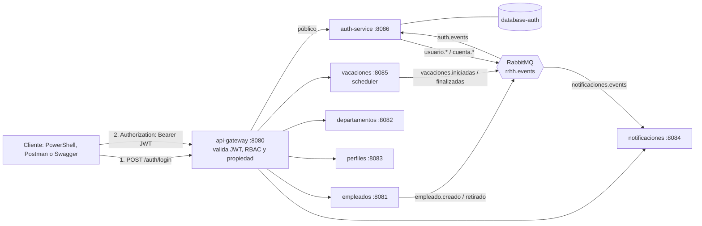
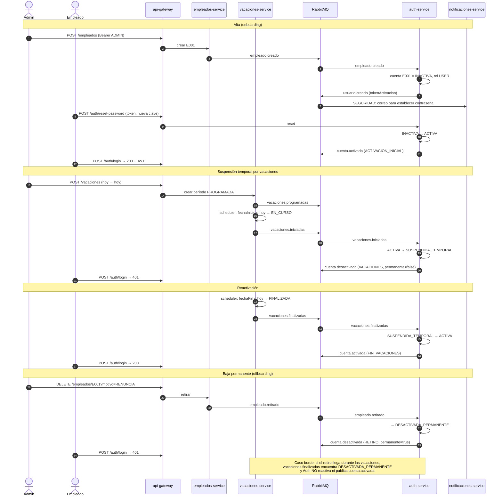

# Reto 5: seguridad y control de acceso con JWT

Este reto agrega autenticación y autorización al ecosistema de microservicios. Un nuevo `auth-service` actúa como proveedor de identidad y emite JWT HS256. El API Gateway valida el token y aplica RBAC y propiedad del recurso antes de enrutar cada petición. El ciclo de vida de las cuentas se dirige por eventos de RabbitMQ: alta, suspensión por vacaciones, reactivación y baja permanente. El scheduler del `vacaciones-service` dispara los eventos de inicio y fin de cada período.

## Estado

**Completado y verificado de punta a punta con Docker Compose.** Los 15 contenedores levantan `healthy` con `docker compose up --build`, y los 18 pasos de prueba del enunciado se ejecutaron contra el sistema integrado el 2026-10-08, con RabbitMQ y PostgreSQL reales. Las salidas están en la sección [Evidencia del flujo integrado](#evidencia-del-flujo-integrado). Los contratos de eventos siguen el Catálogo oficial de Eventos v1.0, secciones 2 y 3.1 a 3.10.

## Arquitectura

| Servicio | Lenguaje | Puerto interno | Origen del código | Base de datos |
|---|---|---|---|---|
| `api-gateway` | Python/FastAPI | 8080, **único publicado** (`127.0.0.1:8080`) | `Reto_5/api-gateway` | — |
| `auth-service` (nuevo) | Python/FastAPI | **8086** | `Reto_5/auth` | `database-auth` (nueva) |
| `empleados-service` | Python/FastAPI | 8081 | `Reto_4/empleados` (sin cambios) | `database-empleados` |
| `departamentos-service` | Node.js/Express | 8082 | `Reto_4/departamentos` (sin cambios) | `database-departamentos` |
| `perfiles-service` | Go | 8083 | `Reto_4/perfiles` (sin cambios) | `database-perfiles` |
| `notificaciones-service` | Java 21/Spring Boot | 8084 | `Reto_5/notificaciones` | `database-notificaciones` |
| `vacaciones-service` | .NET 8 | 8085 | `Reto_5/vacaciones` (con scheduler) | `database-vacaciones` |
| `rabbitmq` | RabbitMQ 4.1 | 5672, y UI en `127.0.0.1:15672` | imagen oficial | — |

El diagrama del enunciado ubica Auth en 8085, pero ese puerto ya pertenece a Vacaciones desde el Reto 4. Por eso Auth escucha en **8086** y el Gateway lo alcanza con `AUTH_URL=http://auth-service:8086`. Ningún servicio de negocio ni Auth publica puertos al host: solo el Gateway es entrada HTTP. Cada base de datos vive en una red `internal` propia.



## Despliegue con Docker Compose

Prerrequisitos: Docker Desktop con WSL 2 y el puerto 8080 libre. Antes de empezar, apague el Reto 4, que usa el mismo puerto.

```powershell
cd C:\Users\Steven\Documents\Micro\Reto_4 ; docker compose down
cd ..\Reto_5
if (-not (Test-Path .env)) { Copy-Item .env.example .env }
docker compose config --quiet
docker compose up --build -d --wait --wait-timeout 300
docker compose ps          # 14 contenedores healthy + rabbitmq-setup terminado
```

Para empezar desde cero (por ejemplo, antes de sustentar): `docker compose down -v`, y después `up` otra vez.

Orden de arranque:
1. `rabbitmq` arranca y queda saludable.
2. `rabbitmq-setup` declara el exchange, las colas y los bindings, y termina.
3. Auth, Empleados, Perfiles, Notificaciones y Vacaciones arrancan con su base sana. Departamentos solo depende de su base.
4. El Gateway arranca cuando Auth y los cinco servicios de negocio están `healthy`.

### Archivos de despliegue del Reto 5

| Archivo | Propósito |
|---|---|
| `docker-compose.yml` | 15 servicios. Reutiliza Empleados, Departamentos y Perfiles desde `../Reto_4` y agrega `auth-service`, `database-auth` y la red `auth-db`. |
| `auth/Dockerfile`, `api-gateway/Dockerfile` | Multi-stage (`pip --prefix=/install`) y usuario no root. El contexto de build es `Reto_5` porque ambos importan `shared/tokens.py`. |
| `notificaciones/Dockerfile` y `src/main/resources/application.properties` | Imagen Maven a JRE 21. Las propiedades conservan el puerto 8084, ACK manual y prefetch 1. |
| `vacaciones/Dockerfile` | SDK .NET 8 a runtime ASP.NET 8. |
| `rabbitmq/setup.py` | Topología idempotente. Agrega la cola `auth.events` y los nuevos bindings de `notificaciones.events`. |
| `logging.json` | Configuración de logs para Uvicorn. Hace visibles los `evento_procesado` de Auth en `docker compose logs`. |
| `.env.example` | Todas las variables, incluidos el secreto JWT y el admin semilla (valores académicos). |
| `comandos_sustentacion_reto5.txt` | Guion PowerShell 5.1 con los 18 pasos de prueba. |

### Topología RabbitMQ

| Cola | Routing keys |
|---|---|
| `auth.events` (nueva) | `empleado.creado`, `empleado.retirado`, `vacaciones.iniciadas`, `vacaciones.finalizadas` |
| `notificaciones.events` | Reto 4: `empleado.creado`, `empleado.retirado`, `vacaciones.programadas`. Reto 5: `vacaciones.iniciadas`, `vacaciones.finalizadas`, `usuario.creado`, `usuario.recuperacion`, `cuenta.activada`, `cuenta.desactivada` |
| `perfiles.events` | `empleado.creado`, `empleado.actualizado`, `empleado.retirado` |
| `vacaciones.empleados` | `empleado.creado`, `empleado.actualizado`, `empleado.retirado` |

## Variables de entorno y clave JWT

Ninguna clave está escrita en el código. Todo se inyecta desde `.env` a través de `docker-compose.yml`. Las variables obligatorias usan la sintaxis `${VAR:?mensaje}`, así que Compose se niega a arrancar si faltan.

| Variable | Servicios | Valor en `.env.example` |
|---|---|---|
| `JWT_SECRET` | auth-service **y** api-gateway (el mismo valor) | `reto5-uniquindio-clave-academica-hs256-no-usar-en-produccion`. Debe tener al menos 32 bytes. **Es solo para uso académico.** |
| `JWT_ACCESS_TTL_SECONDS` / `JWT_RESET_TTL_SECONDS` | auth-service | `900` (15 min) y `1800` (30 min) |
| `ADMIN_EMPLOYEE_ID`, `ADMIN_EMAIL`, `ADMIN_PASSWORD_HASH` | auth-service | `ADMIN`, `admin@empresa.com` y el hash bcrypt de la contraseña de demo **`AdminRrhh2026`** |
| `VACACIONES_SCHEDULER_INTERVAL_SECONDS` | vacaciones-service | `60` (rango de 1 a 3600) |
| `DB_AUTH_*` y el resto de `DB_*` y `RABBITMQ_*` | cada servicio | credenciales locales de demo |

El hash del admin va entre **comillas simples** en `.env`. Sin ellas, Compose interpreta cada `$` del hash bcrypt como una variable y lo corrompe. Para usar otra contraseña, genere un hash nuevo con `docker compose run --rm --no-deps auth-service python hash_admin.py`. En la base solo se guarda el hash. Auth inserta el admin una sola vez, con rol `ADMIN` y estado `ACTIVA`.

## Cómo obtener un token y hacer peticiones autenticadas

### Opción 1: PowerShell

```powershell
# 1. Login del administrador semilla
$login = Invoke-RestMethod -Method Post http://localhost:8080/auth/login `
  -ContentType 'application/json' `
  -Body '{"email":"admin@empresa.com","password":"AdminRrhh2026"}'
$TOKEN = $login.access_token

# 2. Petición autenticada
Invoke-RestMethod http://localhost:8080/empleados -Headers @{ Authorization = "Bearer $TOKEN" }
```

La respuesta del login es `{"access_token": "...", "token_type": "bearer", "expires_in": 900}`. El payload decodificado tiene esta forma:

```json
{ "iss": "rrhh-auth-service", "sub": "ADMIN", "type": "ACCESS", "iat": 1791332573, "exp": 1791333473, "role": "ADMIN" }
```

Un empleado inicia sesión con su email y la contraseña que estableció en `/auth/reset-password`. Su `sub` es su `empleadoId` (por ejemplo, `E001`). El guion `comandos_sustentacion_reto5.txt` trae funciones `Api` y `Login` compatibles con Windows PowerShell 5.1, que devuelven el código HTTP incluso en 401 y 403.

### Opción 2: Swagger (esquema BearerAuth)

1. Obtenga el token con la Opción 1, o desde `http://localhost:8080/auth/docs` con **POST /auth/login** y luego *Try it out*.
2. Abra cualquiera de estas páginas de documentación:
   - `http://localhost:8080/docs` (Gateway)
   - `/auth/docs`
   - `/empleados/docs`
   - `/perfiles/docs`
   - `/notificaciones/docs`
   - `/vacaciones/docs`
3. Pulse **Authorize**, pegue el `access_token` (sin escribir "Bearer") y pruebe los endpoints.

El Gateway inyecta `BearerAuth` y un servidor relativo `/` en los OpenAPI de todos los servicios de negocio. Así, Swagger funciona desde el navegador a través del Gateway.

## Estrategia de validación: en el API Gateway

Se eligió la **opción 1 del enunciado: validar en el Gateway**.

- **Validación escrita una sola vez.** El ecosistema tiene servicios en cinco lenguajes (Python, Node.js, Go, Java y .NET). Validar en cada servicio obligaría a implementar y mantener sincronizadas cinco librerías JWT distintas. En el Gateway la lógica vive una vez, en `api-gateway/gateway_app/main.py`, y usa el mismo módulo `shared/tokens.py` con el que Auth firma.
- **Ya era el único punto de entrada.** Desde el Reto 3 todo el tráfico externo pasa por el Gateway, y los servicios de negocio solo usan `expose`. Ningún cliente puede saltarse la validación.
- **Preparado para el Reto 10.** Cuando la validación migre a JWKS contra un Identity Provider, el cambio se hará en un solo lugar.
- **Identidad propagada de forma segura.** Antes de reenviar una petición, el Gateway borra cualquier `X-Authenticated-Employee-Id` o `X-Authenticated-Role` que envíe el cliente y agrega los valores sacados del JWT validado. Además, no reenvía el Bearer a los servicios de negocio.

Para cada petición no pública, el Gateway exige `Authorization: Bearer`. Luego verifica la firma (solo acepta HS256), `iss`, `exp`, `iat`, que `type` sea `ACCESS` y que `role` sea `ADMIN` o `USER`. Responde **401** si el token falta, está alterado, venció, es de otro algoritmo o es un token de recuperación. Responde **403** si la identidad es válida pero no tiene permiso.

Reglas de autorización (RBAC más propiedad del recurso):

```
si ruta es /auth/change-password       → permitir a cualquier token válido (Auth revalida la cuenta)
si ruta es /notificaciones/seguridad/* → solo ADMIN
si método es GET/HEAD                  → permitir (ADMIN y USER)
si rol == ADMIN                        → permitir
si rol == USER y PUT /perfiles/{id} y id == token.sub → permitir
en cualquier otro caso                 → 403 Forbidden
```

| Ruta | Acceso |
|---|---|
| `POST /auth/login`, `/auth/recover-password`, `/auth/reset-password` | Público |
| `POST /auth/change-password` | Bearer. Auth verifica la contraseña actual de `token.sub`. |
| `GET` o `HEAD` de cualquier recurso | `ADMIN` o `USER` |
| Escrituras en `/empleados`, `/departamentos`, `/notificaciones`, `/vacaciones` | Solo `ADMIN` (un `USER` recibe 403) |
| `PUT /perfiles/{empleadoId}` | `ADMIN`, o `USER` cuando `empleadoId == token.sub` |
| `GET /notificaciones/seguridad/{id}/token` | Solo `ADMIN`. Es el endpoint de demo que entrega el token simulado del correo. |
| `/docs`, `/openapi.json`, `/{servicio}/docs`, `/{servicio}/openapi.json`, `GET /health` | Público |

## Cuentas, contraseñas y tokens

- **Contraseñas.** Solo se guardan como hash **bcrypt** (12 rondas) y nunca viajan en un JWT ni en un evento. La política exige entre 12 y 128 caracteres, máximo 72 bytes, al menos una mayúscula, una minúscula y un dígito.
- **Estados de la cuenta.** Hay cuatro: `INACTIVA`, `ACTIVA`, `SUSPENDIDA_TEMPORAL` y `DESACTIVADA_PERMANENTE`. No es un booleano, así que se puede distinguir una suspensión temporal de una baja permanente.
- **Access token.** Lo devuelve `/auth/login`. Sus claims son `iss`, `sub=empleadoId`, `type=ACCESS`, `role`, `iat` y `exp`. Dura 15 minutos.
- **Token de activación/recuperación** (opción A del enunciado: stateless con JWT). Es un JWT con `type=RESET_PASSWORD`, `sub` y `credentialVersion`, y dura 30 minutos. Cada cambio de contraseña incrementa `credentialVersion`, lo que invalida los tokens anteriores de esa cuenta: por eso reusar un token da 400. No sirve como Bearer de acceso.
- **Recuperación.** `/auth/recover-password` responde lo mismo exista o no el correo, para no revelar cuentas. Solo publica `usuario.recuperacion` si la cuenta existe.

## Eventos

Todos los mensajes usan el sobre oficial: `id` UUID, `type`, `version=1`, `occurredAt` en UTC, `producer` y `data`. Auth valida el productor esperado de cada evento entrante. Guarda el marcador de deduplicación y el cambio de estado de la cuenta en una sola transacción, y solo después hace ACK.

| Auth consume | Acción | Auth publica |
|---|---|---|
| `empleado.creado` | Crea la cuenta `INACTIVA`, con rol `USER` y sin contraseña, y genera el token de activación. | `usuario.creado` {`empleadoId`, `email`, `tokenActivacion`, `expiraEn`} |
| `empleado.retirado` | Pasa la cuenta a `DESACTIVADA_PERMANENTE`. | `cuenta.desactivada` {`motivo: RETIRO`, `permanente: true`} |
| `vacaciones.iniciadas` | Pasa de `ACTIVA` a `SUSPENDIDA_TEMPORAL`. | `cuenta.desactivada` {`motivo: VACACIONES`, `permanente: false`} |
| `vacaciones.finalizadas` | Pasa de `SUSPENDIDA_TEMPORAL` a `ACTIVA`. **Si la cuenta está `DESACTIVADA_PERMANENTE`, no hace nada.** | `cuenta.activada` {`motivo: FIN_VACACIONES`} |
| (HTTP) `POST /auth/reset-password`, primera vez | Pasa de `INACTIVA` a `ACTIVA`. | `cuenta.activada` {`motivo: ACTIVACION_INICIAL`} |
| (HTTP) `POST /auth/recover-password` | — | `usuario.recuperacion` {`email`, `tokenRecuperacion`, `expiraEn`} |

Notificaciones consume los nueve tipos de evento y los guarda con los tipos `ALTA`, `RETIRO`, `VACACIONES`, `SEGURIDAD` y `CUENTA`. El correo de bienvenida sale de `usuario.creado`, que es el evento que trae el token de activación, y no de `empleado.creado`. Cada notificación **simula el envío del correo** con una línea de log en el formato del enunciado:

```
[NOTIFICACIÓN] Tipo: SEGURIDAD | Para: juan.perez@empresa.com | Mensaje: "Para establecer o restablecer su contraseña use el token: eyJhbGciOi... (vence 2026-10-09T00:00:00Z)"
[NOTIFICACIÓN] Tipo: CUENTA | Para: juan.perez@empresa.com | Mensaje: "Su cuenta fue desactivada temporalmente durante sus vacaciones."
[NOTIFICACIÓN] Tipo: CUENTA | Para: juan.perez@empresa.com | Mensaje: "Bienvenido de regreso. Su cuenta fue reactivada al finalizar sus vacaciones."
```

En producción, esa línea sería un correo con un enlace del estilo `https://app.empresa.com/reset?token=...`. El token solo se imprime en el log por fines académicos, para poder extraerlo como pide el paso 5. No aparece en los listados `GET /notificaciones`: se guarda en una columna aparte, con su expiración. Como alternativa al log, un ADMIN puede obtener el token vigente con `GET /notificaciones/seguridad/{id}/token`.

## Diagrama de secuencia del ciclo de vida de la cuenta



## Scheduler de vacaciones

- **Mecanismo:** `VacationScheduler`, un `BackgroundService` de .NET 8 con `PeriodicTimer` (la opción del enunciado para .NET). Se registra con `AddHostedService` en `vacaciones/Program.cs`.
- **Frecuencia:** corre una vez al arrancar el servicio y después cada `VACACIONES_SCHEDULER_INTERVAL_SECONDS` segundos. El valor por defecto es **60**, admite de 1 a 3600 y se configura en `.env`. Para que el cambio aplique: `docker compose up -d vacaciones-service`.
- **Qué hace en cada ciclo:**
  1. Los períodos `EN_CURSO` con `fechaFin ≤ hoy` pasan a `FINALIZADA` y publican `vacaciones.finalizadas`.
  2. Los períodos `PROGRAMADA` con `fechaInicio ≤ hoy` pasan a `EN_CURSO` y publican `vacaciones.iniciadas`.
  
  Cada transición es un `UPDATE ... WHERE estado = <esperado>` condicional, así que no se repite aunque el ciclo se ejecute de nuevo.
- **Cómo se demuestra sin esperar días.** Se eligió la estrategia 1 del enunciado: **programar vacaciones con `fechaInicio = fechaFin = hoy`**. El scheduler finaliza antes de iniciar, así que un período de un día queda `EN_CURSO` durante exactamente un ciclo y pasa a `FINALIZADA` en el siguiente. Con el intervalo de 60 s, la suspensión dura alrededor de un minuto: tiempo suficiente para mostrar el login fallido y después la reactivación.
- **Ojo con la fecha:** "hoy" se calcula en **UTC**. Desde las 7 p. m. de Bogotá, en UTC ya es el día siguiente, así que la fecha debe calcularse con `(Get-Date).ToUniversalTime().ToString('yyyy-MM-dd')`.

### Limitación conocida: escalar a N instancias

El scheduler vive dentro de cada instancia del `vacaciones-service`. Con una sola réplica, que es lo que se acepta en este reto, funciona correctamente. Pero si en el Reto 11 el servicio escala a **N instancias**, cada una ejecuta su propio `PeriodicTimer`, y las N pueden detectar el mismo período vencido al mismo tiempo. El riesgo es publicar `vacaciones.iniciadas` hasta N veces: N correos y N intentos de desactivación.

Hoy hay dos mitigaciones parciales:
1. **El `UPDATE` es condicional por estado.** Solo una instancia gana la transición en PostgreSQL y publica. Esto reduce los duplicados, pero no coordina el trabajo: las N instancias siguen consultando y compitiendo en cada ciclo.
2. **Los consumidores deduplican** (patrón del Reto 4). Auth y Notificaciones descartan los eventos repetidos por su `id`. Esto mitiga el daño, pero no evita el trabajo duplicado. Además, si dos instancias llegaran a publicar, lo harían con `id` distintos.

La solución completa es **coordinar al productor**, de modo que solo una instancia ejecute el job en cada ciclo. Eso se resuelve en el **Reto 31 con ShedLock**, un lock distribuido guardado en la base de datos. Ambas defensas son complementarias. El Reto 11 usará este caso como ejemplo de estado en servicios escalados.

## Evidencia del flujo integrado

Ejecución real el 2026-10-08 sobre `docker compose up` limpio (`down -v` previo), siguiendo `comandos_sustentacion_reto5.txt`.

| # | Prueba | Esperado | Obtenido |
|---|---|---|---|
| 1 | Login del admin semilla | 200 + JWT | **200** |
| 2 | `POST /departamentos`, `POST /empleados` E001 y E002 (ADMIN) | 201 | **201, 201, 201** |
| 3 | Auth consume `empleado.creado` y Notificaciones recibe `usuario.creado` | cuentas `INACTIVA` | E001 y E002 **INACTIVA**, logs `evento_procesado` en ambos servicios |
| 4 | `GET /empleados` sin token / con firma alterada | 401 | **401 / 401** |
| 5 | `reset-password` con el token de activación / reuso del mismo token | 200 / 400 | **200 / 400**, y `cuenta.activada` publicado |
| 6-7 | Login USER y `GET /empleados` | 200 / 200 | **200 / 200** |
| 8 | `recover-password` (existe y no existe), reset y login con clave vieja / nueva | respuesta idéntica, 200, 401, 200 | **misma respuesta, un solo `usuario.recuperacion`, 200, 401, 200** |
| 9 | USER intenta `DELETE /empleados/E001` y `POST /departamentos` | 403 | **403 / 403** |
| 10 | USER E001: `PUT /perfiles/E001` / `PUT /perfiles/E002` | 200 / 403 | **200 / 403** |
| 11 | `change-password`, login con clave anterior / nueva | 200, 401, 200 | **200, 401, 200** |
| 12 | `POST /vacaciones` E001, hoy → hoy (ADMIN) | 201 | **201** (`V-2026-EF5C74`, `PROGRAMADA`) |
| 13 | El scheduler inicia el período, la cuenta se suspende y el login falla | `SUSPENDIDA_TEMPORAL`, 401 | `EN_CURSO` a los 54 s, **SUSPENDIDA_TEMPORAL, 401** |
| 14 | El scheduler finaliza, la cuenta se reactiva y el login funciona | `ACTIVA`, 200 | `FINALIZADA` en el siguiente ciclo, **ACTIVA, 200** |
| 15 | **Caso borde:** E002 retirado durante sus vacaciones | sigue sin poder entrar | **DESACTIVADA_PERMANENTE, 401** (detalle abajo) |
| 16 | `DELETE /empleados/E001?motivo=RENUNCIA` (ADMIN) | 200 | **200**, `empleado.retirado` y `cuenta.desactivada` |
| 17 | Login del empleado retirado | 401 | **401** |
| 18 | `GET /empleados?estado=RETIRADO` | lista con `fechaRetiro` | E001 y E002 con `fechaRetiro` |

Notificaciones de E001: el ciclo de vida completo, en orden.

```
tipo       mensaje
ALTA       Alta de empleado registrada
SEGURIDAD  Cuenta creada: establezca su contraseña con el token de activación
CUENTA     Cuenta activada: ACTIVACION_INICIAL
VACACIONES Vacaciones programadas del 2026-10-08 al 2026-10-08 (1 días hábiles)
VACACIONES Vacaciones iniciadas del 2026-10-08 al 2026-10-08
CUENTA     Cuenta desactivada: VACACIONES
VACACIONES Vacaciones finalizadas el 2026-10-08
CUENTA     Cuenta activada: FIN_VACACIONES
```

### Evidencia del caso borde (paso 15)

E002 inicia sesión (200), toma vacaciones de un día y es retirada mientras el período está `EN_CURSO`. Cuando el scheduler publica `vacaciones.finalizadas`, Auth **lo recibe y no reactiva la cuenta**:

```
auth-service | 23:33:05 INFO evento_procesado              id=667ad5dc-... type=empleado.retirado
auth-service | 23:34:05 INFO evento_duplicado_o_sin_cambio id=9abb59cf-... type=vacaciones.finalizadas

 employee_id |         status
-------------+------------------------
 E002        | DESACTIVADA_PERMANENTE      ← antes y después de vacaciones.finalizadas
```

Notificaciones de E002: después del retiro llega `Vacaciones finalizadas`, pero **no** hay `Cuenta activada: FIN_VACACIONES`.

```
ALTA       Alta de empleado registrada
SEGURIDAD  Cuenta creada: establezca su contraseña con el token de activación
CUENTA     Cuenta activada: ACTIVACION_INICIAL
VACACIONES Vacaciones programadas del 2026-10-08 al 2026-10-08 (1 días hábiles)
VACACIONES Vacaciones iniciadas del 2026-10-08 al 2026-10-08
CUENTA     Cuenta desactivada: VACACIONES
RETIRO     Retiro de empleado registrado: RENUNCIA
CUENTA     Cuenta desactivada: RETIRO
VACACIONES Vacaciones finalizadas el 2026-10-08
```

`POST /auth/login` de E002 después de `FINALIZADA` → **401**. Esto funciona porque el modelo distingue `SUSPENDIDA_TEMPORAL` de `DESACTIVADA_PERMANENTE`. La transición de `vacaciones.finalizadas` solo aplica a cuentas `SUSPENDIDA_TEMPORAL` (función `next_status` en `auth/auth_app/repository.py`).

Estado final en `auth_db`: `ADMIN` en `ACTIVA`, y `E001` y `E002` en `DESACTIVADA_PERMANENTE`.

## Pruebas unitarias

```powershell
.venv\Scripts\python.exe -m pytest Reto_5\tests -q                       # 31 pruebas Python (Auth y Gateway)
dotnet test Reto_5\vacaciones.tests\Vacaciones.Tests.csproj --nologo      # 16 pruebas .NET (reglas y scheduler)
cd Reto_5\notificaciones ; mvn test                                       # 8 pruebas Java (eventos y token ADMIN)
```

La imagen Docker de Notificaciones empaqueta con `-DskipTests`; las pruebas se ejecutan aparte con `mvn test`.

## Límites de seguridad conocidos

- **Tokens ya emitidos.** Un access token emitido sigue pasando el Gateway hasta que expira, aunque la cuenta cambie de estado. El login y `/auth/change-password` sí consultan el estado actual. El TTL corto (15 min) limita esa ventana; la revocación inmediata necesitaría una lista de bloqueo o introspección.
- **Secreto compartido.** El secreto HS256 lo comparten Auth y Gateway (firma simétrica, aceptada por el enunciado). Con firma asimétrica (RS256 o JWKS) solo se compartiría la clave pública.
- **Red interna.** Los servicios de negocio confían en que su HTTP interno no está publicado al host, y eso lo garantiza el compose: solo se usa `expose`.
- **Sin outbox.** Auth y Vacaciones publican después del commit de su base. Si RabbitMQ cae justo en ese instante, el cambio queda confirmado sin su evento.
- **Tokens de entrega en Notificaciones.** Se imprimen en el log del "correo" simulado y se guardan temporalmente en la base de Notificaciones, solo para la demo académica. En producción se enviarían por correo real y no quedarían en logs.
- **Cambio de email.** El catálogo v1 no hace a Auth consumidor de `empleado.actualizado`. Si un empleado cambia de email, Auth sigue reconociendo el anterior para el login.
